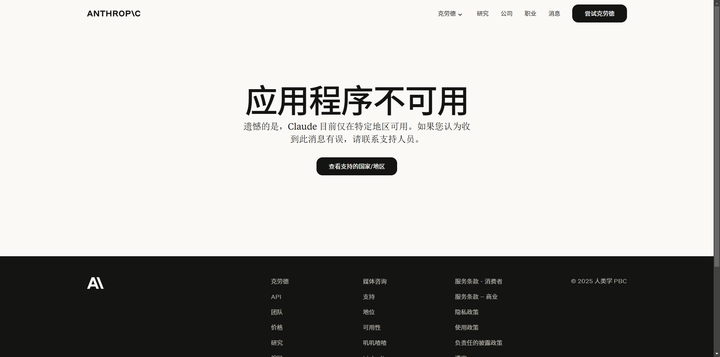
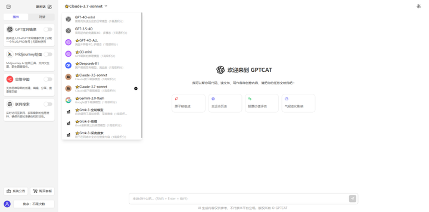

# Claude 是什么？最新Claude 3.7国内访问指南！（2025/3/4）

本指南介绍了 Claude 的企业级功能、使用 Claude 进行开发的端到端流程，以及如何开始构建。

## 一、Claude是什么？
Claude 是由 Anthropic 开发的一系列高性能且智能的 AI 模型。虽然 Claude 功能强大且可扩展，但它也是目前最值得信赖和可靠的 AI。它遵循关键协议，减少错误，并且能够抵御越狱攻击——使企业客户能够大规模构建最安全的 AI 驱动应用程序。

目前 Claude 有 **Claude 3**、**Claude 3.5** 和 **Claude 3.7**系列的多种模型，让您可以在智能、速度和成本之间选择合适的平衡点。

## 二、Claude官网
官网地址：[https://claude.ai](https://claude.ai)

由于 Claude 官网禁止国内访问，所以目前想要访问 Claude 还是非常困难的，而且 Claude 的管控比 ChatGPT 官网还要严格，所以哪怕你有办法可以访问到 Claude 官网，也会随时被封禁账号，让你血本无归。

## 三、国内如何使用 Claude？
国内想要访问 Claude 其实可以访问国内的镜像网站，不仅可以支持最新的 **Claude 3.7**，还支持很多大模型，包括 ChatGPT、DeepSeek、Grok、Gemini 等等。

Claude 镜像网站地址：[https://chat.gptcat.net/](https://chat.gptcat.net/)

## 四、使用 Claude 可以做什么？
### 1. 写代码
GPT 能提供可用性很高的代码，试试就知道了，神器。逻辑复杂、看不懂的代码也可以咨询。比研究生导师能提供的帮助都多。

### 2. 论文撰写、润色、翻译
一句话帮你生成大纲，两句话帮你生成草稿，三句话帮你润色成 SCI 期刊论文。

### 3. 写文案写总结
日报、周报、总结、销售文案、小红书文案、知乎文案……只要和文字相关的工作，GPT 都能帮你写。

### 4. 作为搜索引擎
传统的百度已经全是广告了。一个简单的问题充斥着良莠不齐和重复的问答，一个个的点击筛选会耗费大量时间。如果用 ChatGPT 来搜索，那么它会先帮你精选出一部分优质答案，极大地节省了筛选时间。

### 5. AI 创作
给 GPT 一个标题，它可以帮你列出文章的大纲，再输入一句话可以帮助你把文章的详细内容展现，文章的开头、段落分点、结尾全都给你呈现出来，甚至可以按照你的要求呈现出总分总的结构。现在互联网上很多博主利用这个点来实现创业，通过 GPT 来创作然后投稿赚钱。

希望对你有所帮助。点个赞噢，谢谢！
